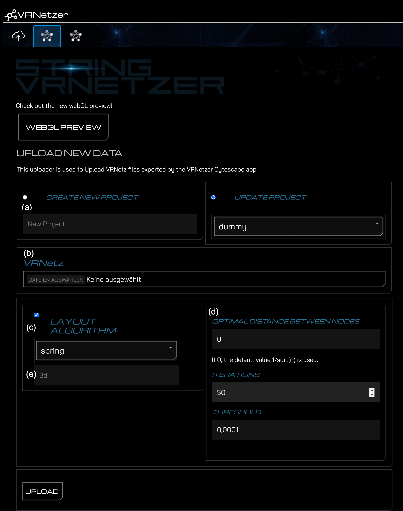
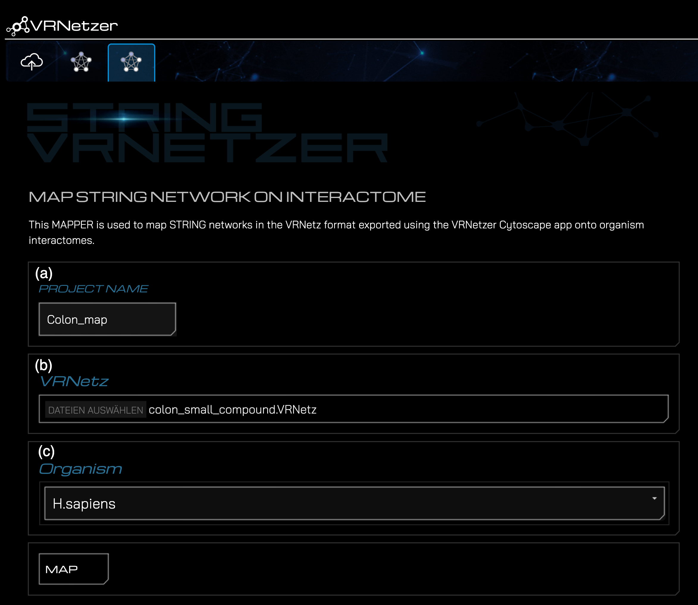

# StringEx

This extension enables the upload and analysis of STRING networks within the VRNetzer platform. In combination with the [StringApp](https://apps.cytoscape.org/apps/stringapp) and [VRNetzerApp](https://github.com/menchelab/STRING-VRNetzer/blob/main/VRNetzerApp/target/VRNetzerApp-1.0.0.jar) created for the widely used software [Cytoscape](https://cytoscape.org/), this extension allows for easy access to STRING networks on the VRNetzer platform.

Furthermore, in combination with the [VRNetzerApp](https://github.com/menchelab/STRING-VRNetzer/blob/main/cytoscapeApp/VRNetzerApp/target/VRNetzerApp-1.0.0.jar) it allows to upload or send any network prepared in Cytoscape to the VRNetzer platform. Through the utilization of the [CyREST](https://apps.cytoscape.org/apps/cyrest) API, a sub-set of a large-scale VRNetzer project can be send to a running Cytoscape session.

## Installation

1. Add the `StringEx` directory to your VRNetzer backend directory. The directory should be located at `"extensions/StringEx"`.
2. Before the line:
   ```
   python -m pip install -r requirements.txt
   ```
   add the following line to the VRNetzer backend's `build and run` script (Windows: `buildandRUN.ps`, Linux: `linux_buildandrun.sh`, Mac: `mac_buildandrun.sh`) :
   ```
   python -m pip install -r extensions/StringEx/requirements.txt
   ```
   If you would like to use cartoGRAPHs to create layouts also add the following line:
   ```
   python -m pip install -r extensions/StringEx/requirements_cartoGRAPHs.txt
   ```
   It should now look something like this:
   ```
   python -m pip install -r extensions/StringEx/requirements.txt
   python -m pip install -r extensions/StringEx/requirements_cartoGRAPHs.txt
   python -m pip install -r requirements.txt
   ```

## Usage

### Upload network from Cytoscape

1. Export a network with the VRNetzerApp from Cytoscape. For further instructions see [here](https://github.com/menchelab/STRING-VRNetzer).
2. Start the VRNetzer backend using the script applicable to your operating system.
3. Navigate in your Browser to http://127.0.0.1:5000/upload (Windows/Linux) / http://127.0.0.1:3000/upload (mac)
4. If the StringEx is correctly installed, you should now see two new tabs. The first is the VRNetz designated uploader

   

5. On this tab, (a) define a project name, (b) select the VRNetz file of your exported network, and (c) select the desired layout algorithm.
6. You can (d) also define the respective variables.
7. You can (e) provide a name for the generated node layout.
8. Click on the "Upload" button to upload the network to the VRNetzer platform.
9. If the upload was successful, you'll be prompted with a success message and a link to preview the project in the designated WebGL previewer.

---

### Map an exported network on a preprocessed PPI

Do the first three steps as mentioned [above](#upload-string-network).

4. The second tab is the STRING mapper.

   

5. On this tab, (a) define a project name, (b) select the VRNetz file of your exported String network, and (c) select the organism from which your VRNetz originates of.
6. Click on the "Map" button to map the network with the preprocessed PPI.
7. If the upload was successful, you'll be prompted with a success message and a link to preview the project in the designated WebGL previewer.
